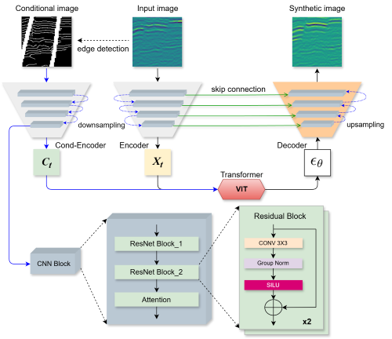

# ConSeisDiff
**Conditional Diffusion Model for Generating Synthetic Seismic Data**

This repository provides the training code and Colab notebook for **CoSeDif** (Conditional Seismic Diffusion), a conditional denoising diffusion model designed to generate high-fidelity synthetic seismic data. By conditioning on fault attributes and edge maps, CoSeDif produces realistic 2D seismic images.

For usage, please refer to the inference notebook, which demonstrates how to generate synthetic data and calculate relevant metrics.

## Current Status
This repository is under active development for ongoing research purposes. It supports the results presented in our latest work on seismic analysis, which is currently under review for publication in a journal. We aim to continue improving and expanding this codebase.

## Contributions
We welcome any suggestions, feedback, or contributions to further develop this project. Your input is valuable in enhancing the effectiveness and applicability of this model.

## Licensing
This code is publicly available and can be used for academic purposes. Please ensure proper citation when utilizing this work in your research.
